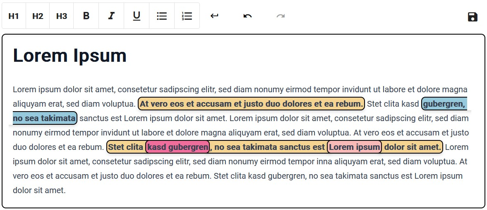

# Tiptap Annotation Magic
## Description

This is an extension for the [Tiptap](https://github.com/ueberdosis/tiptap) editor (based on ProseMirror). It's unique
for its ability to **render overlapping annotations** as fragments. Annotations are rendered as [Decorations](https://prosemirror.net/docs/ref/#view.Decorations)
and are therefore not a part of the Prosemirror Document.


## Setup

### Install Tiptap

`npm install --save @tiptap/core @tiptap/pm @tiptap/starter-kit`

### Install Annotation Magic

`npm install --save tiptap-annotation-magic`

### Configuration

Add `AnnotationMagic` to the list of your extensions.

```{ts}
extensions: [
    StarterKit,
    AnnotationMagic.configure({
        onAnnotationListChange: (annotations) => {
            // Callback when annotation is created/deleted/updated
        },
        onSelectionChange: (selectedAnnotations) => {
            // Callback when the selected editor text changes
        },
        styles: {
            // CSS classes to use for different fragments
            leftFragment: 'fragment-left',
            rightFragment: 'fragment-right',
            middleFragment: 'fragment-middle',
            normal: 'annotation-normal',
        }
    })
]
```

## Commands

```{ts}
// Create an annotation containing `data` at the selected text location
editor.chain().focus().addAnnotation(data).run();

// Update an annotations `data`
editor.chain().focus().addAnnotation(id, data).run();

// Remove an existing annotation
editor.chain().focus().deleteAnnotation(id).run();
```

## Demo

See a Demo using React on [Stackblitz](https://stackblitz.com/edit/stackblitz-starters-4gxggz?file=src%2FTiptap.tsx)